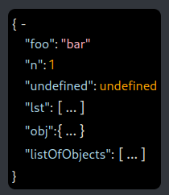
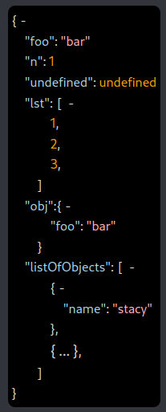
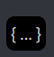

# jsonview

Simple component for viewing JSON data

NPM: https://www.npmjs.com/package/@blakeasm/jsonview

## Usage

```jsx
import JsonView from "@blakeasm/jsonview"

function YourJsonViewerComponent() {
  const data = {
    foo: "bar",
    n: 1,
    "undefined": undefined,
    lst: [1, 2, 3],
    obj: {foo: "bar"},
    listOfObjects: [{name: "stacy"}, {name: "judas"}]
  }

  return (
    <JsonView data={data} depth=1></JsonView>
  )
}

export default App

```




